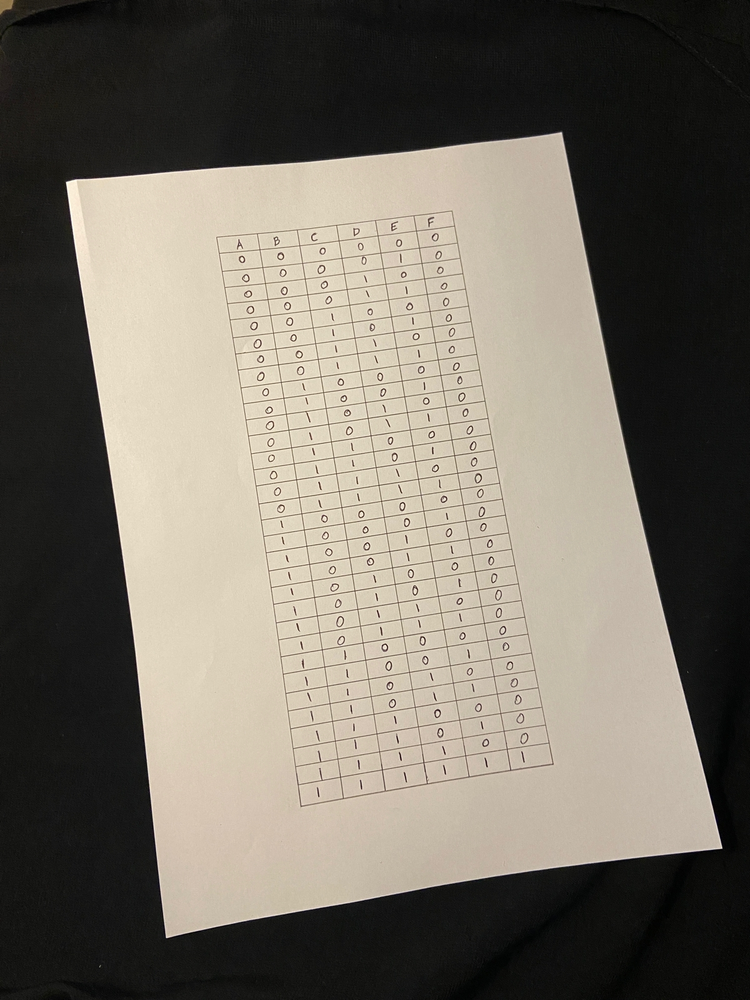
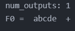
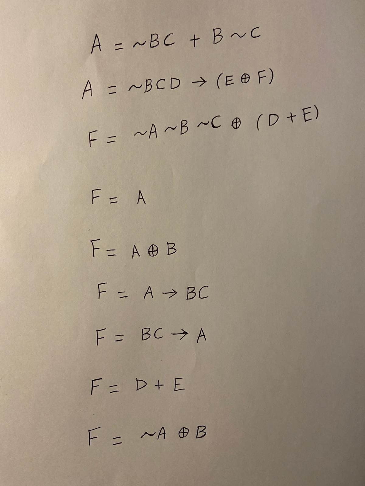
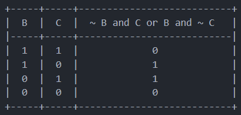
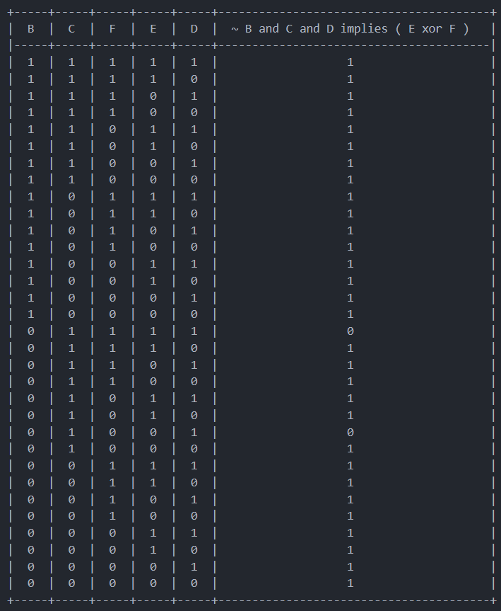
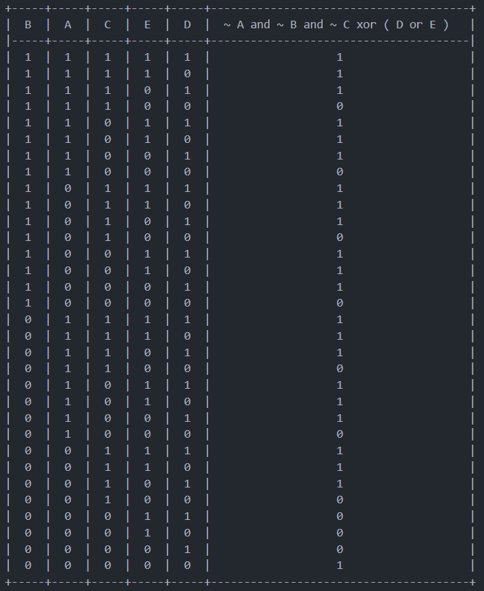
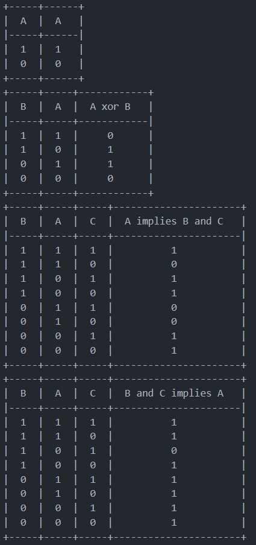
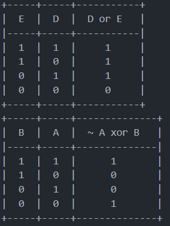

    


# Description

LogIm is an application that allows you to get the truth table of a logical expression, or the corresponding logical expression of a given truth table, only by taking a picture of it! 

# Technologies


# Installation

This code runs in JupyterNotebook, so you must have anaconda installed first

[Anaconda download](https://www.anaconda.com/products/distribution)

```
conda install pip

```

```
pip install opencv-python
pip install truth-table-generator
pip install ipynb
pip install image
pip install customtkinter

```

# Run

###### To run through Jupyter Notebook

Navigate to final_integration.py

Run all cells

Create a new cell containing the code below

```
## new cell code ##
image = cv2.imread("./image_path") #replace with your image path

solve_expression(image, is_table=bool) #for solving an expression, False for is_table
				       #for solving a truth table, True for is_table

```

###### To run through GUI

run the following command in your terminal

```
python ./table.py
```

# Samples

###### Input image



###### Output



###### Input image




###### Output










# Collaborators

| [Sarah Elzayat](https://github.com/SarahElzayat) | [Ahmed ata abdallah](https://github.com/Ahmed-ata112) | [Nour Ziad Almulhem](https://github.com/nouralmulhem) | [fady](https://github.com/fady2001) |
| --------------------------------------------- | -------------------------------------------------- | -------------------------------------------------- | -------------------------------- |
